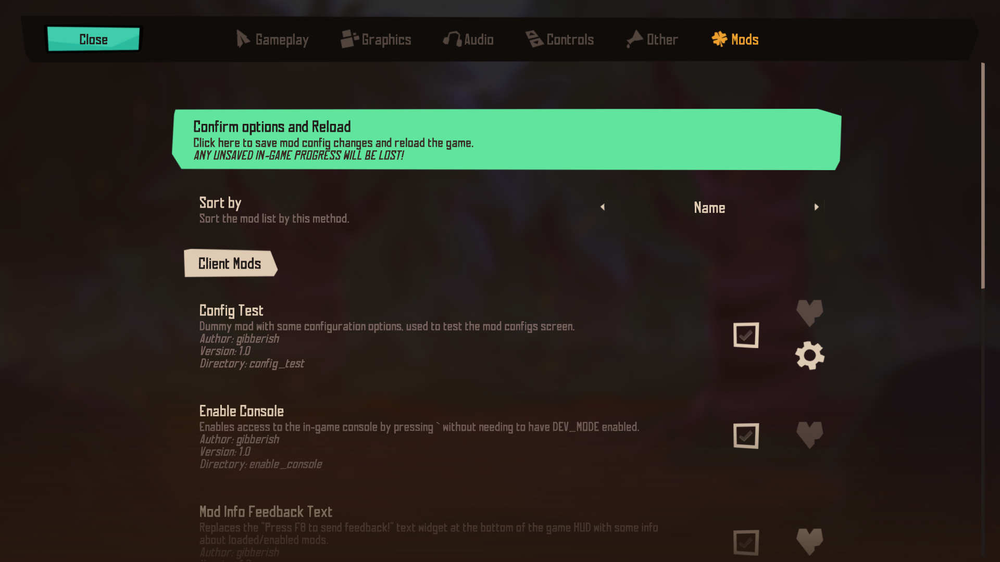
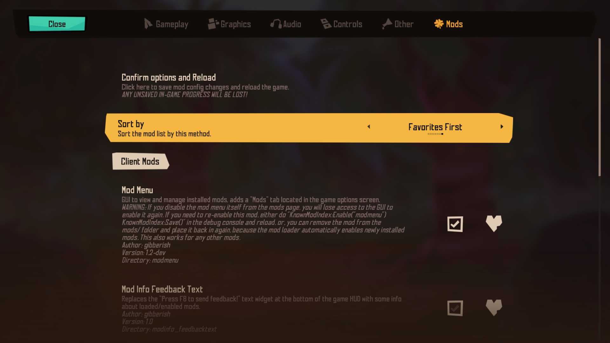
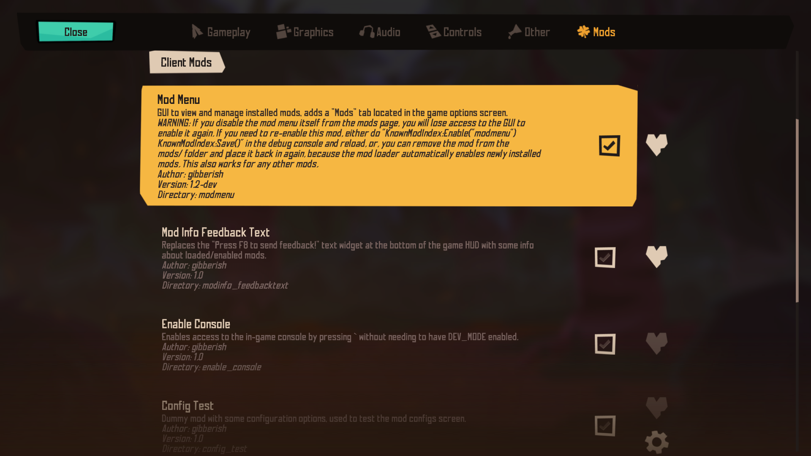
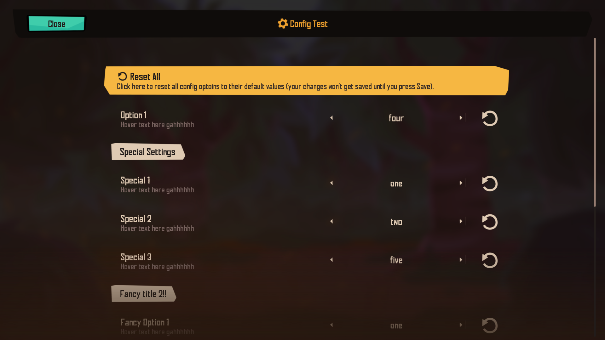
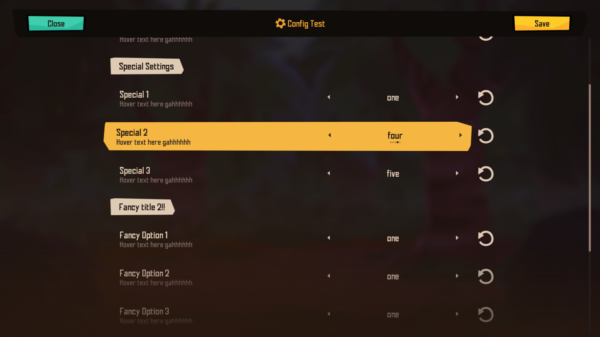

# Loading mods

**PLEASE READ: (May 25th 2024) Since the last couple of EA versions, there have been some changes that made your save files incompatible once DEV_MODE is enabled or when playing with mods, causing crashes with no meaningful errors or making the game prompts you to delete your saves to continue playing. Please proceed with caution and make backups of your saves (located in AppData/Roaming/Klei/Rotwood)**

**Original post on Klei forums:** https://forums.kleientertainment.com/forums/topic/155849-unofficial-modding-support/

 Right now the built in mod loader of Rotwood is not complete and is disabled so by default it will not work properly. But it is possible to load and run mods, if you bypass the mod manager and load them yourself. After tinkering for a while now I have found a method to do so.

Please note that this is still very bare bones and some modding API features might not work correctly or at all.

List of things that you can and cannot do with modding right now (might be incomplete):
- Working:
    + General modding (globals, players, entities, components. events, inputs, etc)
    + Modifying classes, constants, strings, etc
    + Custom widgets, screens and UI overall
    + Custom stategraphs
    + Upvalue modifying (can use UpvalueHacker with some minor changes)
    + `modinfo` (using the same variables as DST)
    + `modimport`
    + `modsettings.lua` (used to force load mods)
    + Basically cheating (Since your game client manages your local player entities, even if you're not the host, you can do anything to yourself) (does Rotwood use peer to peer networking instead of server-clients? You can't c_spawn() if you're not the host though)
- Not working / haven't tested:
    + Add*PostInit (reason: not implemented)
    + Custom components (reason: not implemented)
    + Custom textures/animations (reason: not implemented and insufficient modding tools)
    + Networking (communicating with remote clients and sending data back and forth) (reason: not implemented and/or not enough info about how the networking system works)
    + Mod configurations (reason: implemented but haven't tested, if you can please test this and tell me if there's any issues)
    + loading other mod scripts with `require` (reason: not implemented)

# How to load mods

**Editing the game scripts requires you to have extracted scripts and use modified scripts (see [Extracting game scripts](extracting_game_scripts.md)), mods will stop working if you decide to switch back to the original scripts. In some rare cases, playing with mods, then reverting back to vanilla scripts can cause bugs and glitches, so you should definitely make backups of your saves.**

 To enable mods and make the mod manager usable, you will first need to modify a few lines in the game scripts, as follows: 

 ## In `mods.lua`

In `function CreateEnvironment(modname, isworldgen)`, comment the following lines:

```lua
require("map/lockandkey")
```

```lua
GROUND = GROUND,
LOCKS = LOCKS,
KEYS = KEYS,
```

## In `modutil.lua`

 In `local function InsertPostInitFunctions(env, isworldgen)`, near the end of the function, comment the following lines:

 ```lua
 env.Ingredient = Ingredient
 ```

 ```lua
 env.MOD_RPC = MOD_RPC --legacy, mods should use GetModRPC below
 ```

## In `main.lua`

After editing the mod loader to make it work, now you have to enable mods by adding this line: 

```lua
MODS_ENABLED = true
```

I recommend putting it in the `--defines` block, like this: 

```lua
...
--defines
MODS_ENABLED = true
MAIN = 1
IS_QA_BUILD = TheSim:GetCurrentBetaName() == "huwiz"
...
```

Near the end of `main.lua` there's also an `assert` call that was purposefully put there to make the game closes if mods are enabled, so you'll need to disable that too, simply comment that line like this: 

```lua
    --#V2C no mods for now... deal with this later T_T
	--assert(true)
```

 Last but not least, our very own mod loader, paste this at the end of `main.lua`: 

 ```lua
local mods_to_load = {}
for _,modname in ipairs(TheSim:GetModDirectoryNames()) do
    local fn = kleiloadlua(MODS_ROOT..modname.."/".."modmain.lua")
    if fn ~= nil then -- fix: only load and run a mod if it has a valid function, prevents crashes when loading an invalid or empty mod folder
        if KnownModIndex.savedata and KnownModIndex.savedata.known_mods and KnownModIndex.savedata.known_mods[modname] then		
            -- check if the mod's enabled state is nil
            -- if it is then this usually means the mod is newly loaded and hasnt been configured
            -- this will not catch mods that were disabled specifically
            if KnownModIndex.savedata.known_mods[modname].enabled == nil then
                -- new mods are enabled by default
                KnownModIndex:Enable(modname)
            end

            -- at this point the enabled state should be set and we just need to check
            -- if the mod is enabled (or force enabled) or not to load it
            if KnownModIndex:IsModEnabled(modname) or KnownModIndex:IsModForceEnabled(modname)  then
                local initenv = KnownModIndex:LoadModInfo(modname)
                local env = CreateEnvironment(modname)
                env.modinfo = initenv
                table.insert(mods_to_load, {
                    fn = fn,
                    env = env,
                    modinfo = env.modinfo,
                    name = env.modinfo.name or modname,
                    modname = modname
                })
            end
        end
    end
end 
KnownModIndex:Save() -- save mods' enabled states if any were changed during loading

-- now we have a table of all mods that need to be loaded,
-- we need to load it based on priority
local function modPrioritySort(a,b)
    local apriority = (a.modinfo and a.modinfo.priority) or 0
    local bpriority = (b.modinfo and b.modinfo.priority) or 0
    if apriority == bpriority then
        return tostring(a.modinfo and a.modinfo.name) > tostring(b.modinfo and b.modinfo.name)
    else
        return apriority  > bpriority
    end
end
table.sort(mods_to_load, modPrioritySort)

-- we're all set, lets load them
print("loading mods...")
for _,mod in ipairs(mods_to_load) do
    package.path = MODS_ROOT..mod.modname.."\\scripts\\?.lua;"..package.path
    RunInEnvironment(mod.fn, mod.env)
    print("mod \""..mod.name.."\" loaded! priority: "..tostring(mod.modinfo.priority or 0))
end
```

This is the script that is responsible for loading the mod files, basically what it does is go through every subdirectories in the `mods/` folder placed in the game root directory and load every `modmain.lua` file, along with their `modinfo.lua` if found. 

# Thanks for reading

Your game is now patched and it should automatically load all mods put inro `{game directory}/mods` (you'll have to create the `mods` folder yourself), here's an example directory tree to help you visualize: 

```
Rotwood/
    bin/
        ...
    data/
        licenses/
        scripts/
        ...
    localizations/
        ...
    mods/
        sample_mod/
            modinfo.lua
            modmain.lua
            utils/
                ...
        sample_mod_2/
            modinfo.lua
            modmain.lua
            ...
    data.zip
    ...
```

The mod scripts are run using the mod environment, not the game environment, so you can write them like normal mods (like DS/T mods).

You can also write `modinfo.lua` files for your mods and they will be read correctly.

The `mods/` directory and everything inside it will persist through game updates, but the changes you made to your game scripts won't, so you'll have to patch the game to enable mods every time the game updates, it might seem like a lot of work, but this is way better than editing every single game sscript files to add "mods" yourself. 

Also you should make backups of everything you want to keep, just to be safe, plus it's good practice.

This might not be the most optimal method, but for now it works, and I hope we can improve it as time goes on. Happy modding :3 

**NOTE:** The game might not load mods on the first startup with mods, you might need to restart it one more time to load everything.

# Debugging Mods

**(June 23rd 2024) I have just added modsettings.lua support as well as some minor clean ups of the main.lua mod loader script, I recommend patching your main.lua again, just copy and replace the old snippet with the new code.**

If you're making a mod and it ever causes a fatal game crash (error popup), or just simply a mod you installed caused that (which is unlikely but can still happen), the game by default will disable all mods on the next launch. To enable your mods again, you can either:

- Remove mods from the `mods` folder, restart the game, close the game, place mods back in the `mods` folder, start the game again (by default newly installed mods will be enabled, this behavior is intended because there is no built in mod manager screen so you don't have an easy way to enable installed mods)
- If you have access to the debug console, run `KnownModIndex:Enable("modname")`, followed by `KnownModIndex:Save()`, then reload the game, `modname` correspondss to the directory name of the mod in the `mods` folder.

Another easier way to have a selection of your mods (known stable ones or the mod that you're debugging) always loaded regardless of crashes is to use `modsettings.lua`, simply create a `modsettings.lua` file in your `mods` directory. This works exactly the same as DS/T's `modsettings.lua`

In this script you can write `ForceEnableMod("modname")` for mods that you would like the game to load even after mod crashes.

# (Optional) Mod Menu

I also made a mod that adds a "Mods" page to the game's options screen, to let you more easily see and manage installed mods.

**If you came from the forums post and have installed the old "modlist" mod, this is a new updated version, and its name has been changed to Mod Menu, so you'd want to remove the old one and replace it with this one instead.**

If you use the mod menu mod, I recommend also force enabling it in `modsettings.lua` (see section "Debugging Mods" above) to have it always available after your mod crashes.

Here are some images of it:






