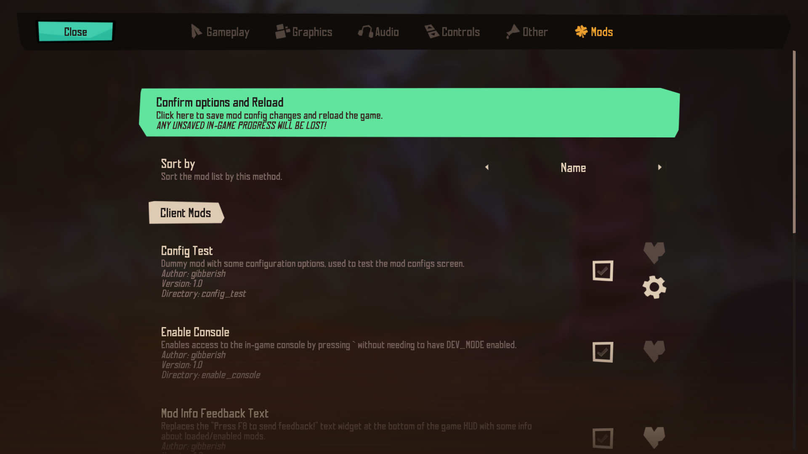
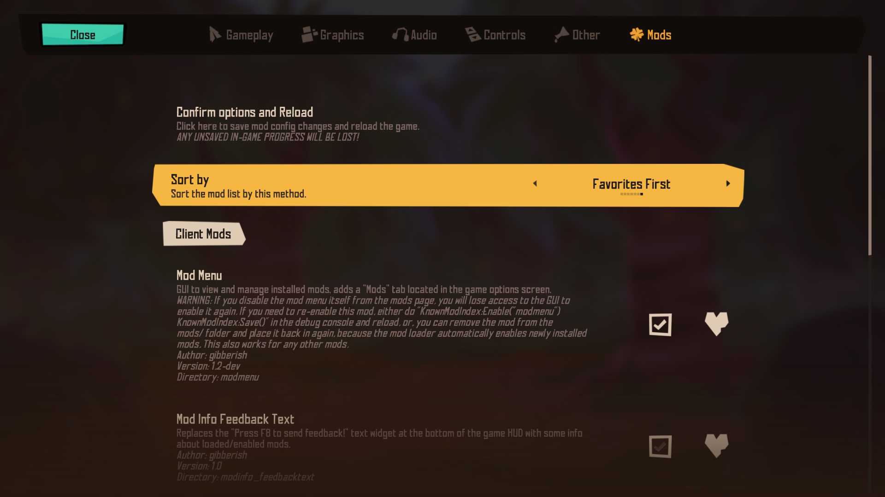
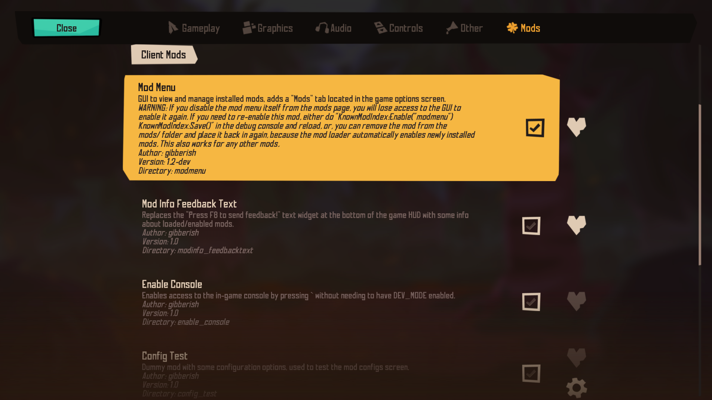
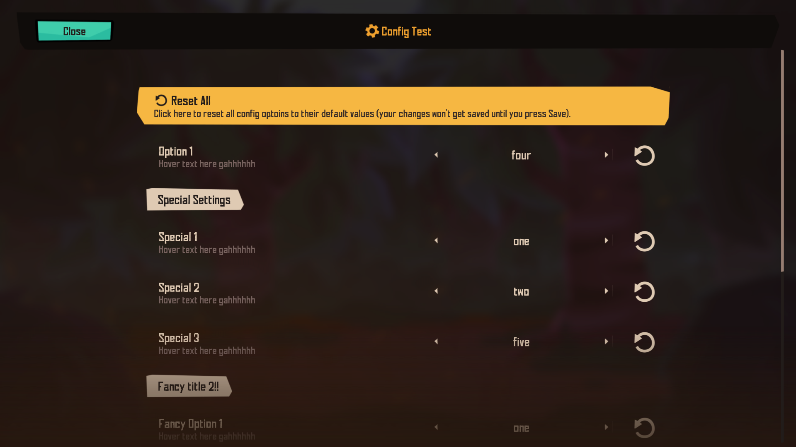
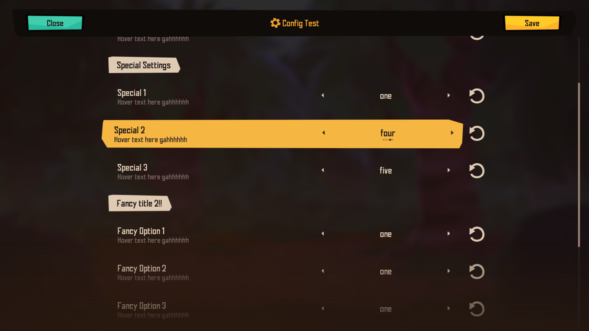

# Loading mods

**Original post on Klei forums:** https://forums.kleientertainment.com/forums/topic/155849-unofficial-modding-support/

 Right now the built in mod loader of Rotwood is not complete and is disabled so by default it will not work properly. But it is possible to load and run mods, if you bypass the mod manager and load them yourself. After tinkering for a while now I have found a method to do so.

Please note that this is still very bare bones and some modding API features might not work correctly or at all. So far I have confirmed that `modinfo` and some features in the `modmain` environment like `modimport` and functions like `AddClassPostConstruct` work. 

# How to load mods

**Editing the game scripts requires you to have extracted scripts and use modified scripts (see [Extracting game scripts](extracting_game_scripts.md)), mods will stop working if you decide to switch back to the original scripts. In some rare cases, playing with mods, then reverting back to vanilla scripts can cause bugs and glitches, so you should definitely make backups of your saves.**

 To enable mods and make the mod manager usable, you will first need to modify a few lines in the game scripts, as follows: 

 ## In `mods.lua`

In `function CreateEnvironment(modname, isworldgen)`, comment the following lines:

```lua
require("map/lockandkey")
```

```lua
GROUND = GROUND,
LOCKS = LOCKS,
KEYS = KEYS,
```

## In `modutil.lua`

 In `local function InsertPostInitFunctions(env, isworldgen)`, near the end of the function, comment the following lines:

 ```lua
 env.Ingredient = Ingredient
 ```

 ```lua
 env.MOD_RPC = MOD_RPC --legacy, mods should use GetModRPC below
 ```

## In `main.lua`

After editing the mod loader to make it work, now you have to enable mods by adding this line: 

```lua
MODS_ENABLED = true
```

I recommend putting it in the `--defines` block, like this: 

```lua
...
--defines
MODS_ENABLED = true
MAIN = 1
IS_QA_BUILD = TheSim:GetCurrentBetaName() == "huwiz"
...
```

Near the end of `main.lua` there's also an `assert` call that was purposefully put there to make the game closes if mods are enabled, so you'll need to disable that too, simply comment that line like this: 

```lua
    --#V2C no mods for now... deal with this later T_T
	--assert(true)
```

 Last but not least, our very own mod loader, paste this at the end of `main.lua`: 

 ```lua
 local mods_to_load = {}
for _,modname in ipairs(TheSim:GetModDirectoryNames()) do
	local fn = kleiloadlua(MODS_ROOT..modname.."/".."modmain.lua")
	if fn ~= nil then -- fix: only load and run a mod if it has a valid function, prevents crashes when loading an invalid or empty mod folder
		if KnownModIndex.savedata and KnownModIndex.savedata.known_mods and KnownModIndex.savedata.known_mods[modname] then		
			-- check if the mod's enabled state is nil
			-- if it is then this usually means the mod is newly loaded and hasnt been configured
			-- this will not catch mods that were disabled specifically
			if KnownModIndex.savedata.known_mods[modname].enabled == nil then
				-- new mods are enabled by default
				KnownModIndex.savedata.known_mods[modname].enabled = true
			end

			-- at this point the enabled state should be set and we just need to check
			-- if the mod is enabled or not to load it
			if KnownModIndex.savedata.known_mods[modname].enabled  then
				local initenv = KnownModIndex:LoadModInfo(modname)
				local env = CreateEnvironment(modname)
				env.modinfo = initenv
				table.insert(mods_to_load, {
					fn = fn,
					env = env,
					modinfo = env.modinfo,
					name = env.modinfo.name or modname
				})
			end
		end
	end
end 
KnownModIndex:Save() -- save mods' enabled states if any were changed during loading

-- now we have a table of all mods that need to be loaded,
-- we need to load it based on priority
local function modPrioritySort(a,b)
	local apriority = (a.modinfo and a.modinfo.priority) or 0
	local bpriority = (b.modinfo and b.modinfo.priority) or 0
	if apriority == bpriority then
		return tostring(a.modinfo and a.modinfo.name) > tostring(b.modinfo and b.modinfo.name)
	else
		return apriority  > bpriority
	end
end
table.sort(mods_to_load, modPrioritySort)

-- we're all set, lets load them
print("loading mods...")
for _,mod in ipairs(mods_to_load) do
	RunInEnvironment(mod.fn, mod.env)
	print("mod \""..mod.name.."\" loaded! priority: "..tostring(mod.modinfo.priority or 0))
end
```

This is the script that is responsible for loading the mod files, basically what it does is go through every subdirectories in the `mods/` folder placed in the game root directory and load every `modmain.lua` file, along with their `modinfo.lua` if found. 

# Thanks for reading

Your game is now patched and it should automatically load all mods put inro `{game directory}/mods` (you'll have to create the `mods` folder yourself), here's an example directory tree to help you visualize: 

```
Rotwood/
    bin/
        ...
    data/
        licenses/
        scripts/
        ...
    localizations/
        ...
    mods/
        sample_mod/
            modinfo.lua
            modmain.lua
            utils/
                ...
        sample_mod_2/
            modinfo.lua
            modmain.lua
            ...
    data.zip
    ...
```

The mod scripts are run using the mod environment, not the game environment, so you can write them like normal mods (like DS/T mods).

You can also write `modinfo.lua` files for your mods and they will be read correctly.

The `mods/` directory and everything inside it will persist through game updates, but the changes you made to your game scripts won't, so you'll have to patch the game to enable mods every time the game updates, it might seem like a lot of work, but this is way better than editing every single game sscript files to add "mods" yourself. 

Also you should make backups of everything you want to keep, just to be safe, plus it's good practice.

This might not be the most optimal method, but for now it works, and I hope we can improve it as time goes on. Happy modding :3 

# (Optional) Mod Menu

I also made a mod that adds a "Mods" page to the game's options screen, to let you more easily see and manage installed mods.

**If you came from the forums post and have installed the old "modlist" mod, this is a new updated version, and its name has been changed to Mod Menu, so you'd want to remove the old one and replace it with this one instead.**

Since there's so much new stuff in this new version, and I'm also not a well experienced modder, I cannot ensure that I can fully test everything to make sure it's bug-free, I decided that I will be releasing this as testing first, the stable version will come shortly after (no, it's not like the mod is full of bugs, I've made sure to test all the basic functionalities beforehand, I'm just letting you know that it's still in very active development and there might be some rare edge cases where stuff might not work as intended, but I hope we can get all that sorted out). The mod can be found in the `mods` folder of this repository.

Here are some images of it:






