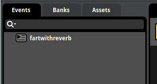
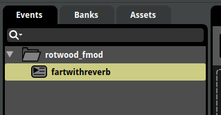

# Modded Audio

## Prerequisites

It's possible to load and use custom audio banks with mods, you will need the following:

- For proper support for loading modded assets, use the [ModWrangler modloader patch](https://github.com/zgibberish/rotwood-modloader/blob/modwrangler/README.md).
- [FMOD Studio](https://www.fmod.com/download) to make audio bank files, any modern version should work but I use 2.02.20 so I would recommend getting that one.
- My pre-made FMOD project file that's compatible with Rotwood (more about this below), you can find it at `assets/modded_audio/rotwood_fmod.zip`.

Rotwood uses a newer version of FMOD for audio (not the same as DST's), and has many similar properties to Griftlands.

The newer bank file format used is `.bank`, not `fev`+`fsb`. If you export using a new FMOD Studio version you'd get `.bank` files. Don't use FMOD Designer included in the Don't Starve Mod Tools suite, it's not compatible.

Rotwood can't load more than 1 master bank, so modded bank files must have the same master bus GUID as the game's built-in master bank. So we would need to find out Rotwood's master bus's GUID, but there's no way from within the game to get that. Though I've found that you can use other tools to read the GUIDs from a compiled `.bank` file. What I did was make a simple Unity project with the FMOD addon, and used FMOD's API in Unity to read Rotwood's master bank's bus GUIDs.

I won't go into much detail on how to create a Unity project since that's beyond the scope of this guide, and you most likely won't need to do this anyway. What I did was create an empty 2D game project, added the FMOD addon, followed the FMOD setup tool to include `.bank` files (in this case is Rotwood's Master.bank), then I added a script to one of the game objects and made it load and print out all the bus GUIDs in the bank file. If you want to have a look at it, I've also included said script in this repo, you can find it at `assets/modded_audio/guid_extractor_script.cs`.

Below is Rotwood's master bus's GUID:

```txt
{28889e88-e58b-440c-9687-8879e4f60424}
```

So what you would need is to have your custom FMOD project file's master bus's GUID matching this string. To get your current master bus GUID in FMOD Studio, open the mixer window (Ctrl+2), right click "Master Bus" on the left pane and select "Copy GUID". Then you can use a text editor to do a simple find and replace on all occurrences in your project folder.

**NOTE:** You most likely won't need to do all the steps above, I'm just documenting the whole process. For that you can use the FMOD project I already made included in this repo (that already has a modified master bus) as a template to start adding your own sound events.

## Usage

Once you have a Rotwood compatible FMOD project (either the empty template included in this guide or one you made yourself), you can start adding sound events in FMOD Studio, you can rename the master bank to whatever you want, my template has the master bank given the same name as the project name ("rotwood_fmod").

For how to use FMOD Studio you can look online for guides and tutorials (it's just a more modern version of FMOD Designer with roughly the same UI if you're a DS/T modder and are familiar with that). Just add sound events, attach sound assets, organize your events and add params if you need to and hit `F7` to build, compiled `.bank` files will be placed in your project's `Build` directory.

Your compiled master bank will also come with another `.strings.bank` file, this file contains the strings to reference to all the event names in your FMOD project, you'll also need to load this file to properly call your sound events by name.

### Example Mod

```txt
sound-test/
├─ sound/
│  ├─ rotwood_fmod.bank
│  ├─ rotwood_fmod.strings.bank
├─ modmain.lua
├─ modinfo.lua
```

`modmain.lua`

```lua
Assets = {
    Asset("SOUND", "sound/rotwood_fmod.bank"),
    Asset("SOUND", "sound/rotwood_fmod.strings.bank"),
}

local fmodtable = require "defs.sound.fmodtable"

RemapSoundEvent(fmodtable.Event.Emote_stunk_fart, "rotwood_fmod/fartwithreverb")

-- PlaySound example
-- inst.SoundEmitter:PlaySound("rotwood_fmod/fartwithreverb")
```

This mod uses `RemapSoundEvent` to replace a built-in event with a modded one.

**NOTE:** Not sure what's causing this yet (either a modding API bug or this is simply just how it works in this FMOD version), but modded event paths don't include the bank name as the root, so for an FMOD project that looks like this:



This event's path to use in scripts would be just `fartwithreverb`, not `rotwood_fmod/fartwithreverb` ("rotwood_fmod" being the bank name).

So I would recommend having a root folder containing every event/folder in your modded FMOD projects, like this:



So your event path would be like this: `rotwood_fmod/fartwithreverb`

Also this may help separate different mods's FMOD events better.

## Sources

### Griftlands modding forum posts

Many thanks to RageLeague and Klei! I got a ton of useful info from your forums posts that really helped me with this!

- <https://forums.kleientertainment.com/forums/topic/123466-how-to-add-or-modify-in-game-sounds/>
- <https://forums.kleientertainment.com/forums/topic/130511-figured-out-how-to-mod-audio/>
- <https://forums.kleientertainment.com/forums/topic/130905-official-audio-support/>

### FMOD & Unity

I used Unity to extract bus paths and GUIDs from Rotwood's master bank file, here are some useful info that I've gathered:

- (FMOD for Unity addon) <https://assetstore.unity.com/packages/tools/audio/fmod-for-unity-161631>
- (Unity script that I used for reference to use FMOD's API in Unity) <https://qa.fmod.com/t/how-to-get-guids-from-banks-using-unity/21205>
- (FMOD API docs) <https://www.fmod.com/docs/2.00/api/welcome.html>
